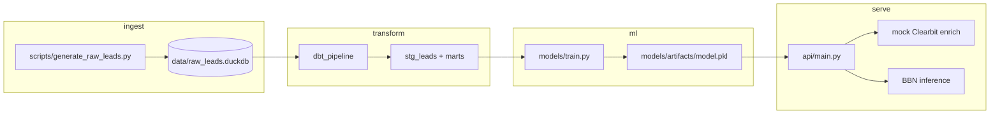

# Latent Sentiment BBN

End-to-end pipeline for inferring latent customer sentiment from firmographics and engagement signals using a Bayesian belief network (pgmpy), a local DuckDB warehouse, dbt transformations, and a FastAPI serving layer.

## Repository layout

```
├── data/                    # Local warehouse storage (.duckdb files)
├── dbt_pipeline/            # Complete dbt project
│   ├── models/              # dbt SQL transformation models
│   ├── dbt_project.yml      # dbt configuration
│   └── profiles.yml         # Connection profile for DuckDB
├── src/                     # Core application source code
│   ├── __init__.py
│   ├── api/                 # FastAPI application layer
│   │   ├── main.py          # API entry point & routes
│   │   └── services.py      # Mock Clearbit & model loading logic
│   ├── data_gen/            # Synthetic data generation scripts
│   └── models/              # pgmpy training and inference logic
│       ├── train.py         # Structure & parameter learning script
│       └── artifacts/       # Saved serialized model (model.pkl)
├── tests/                   # PyTest suite for API and transformations
├── pyproject.toml           # uv dependencies and metadata
└── README.md
```

## Architecture



## Structure Learning Constraints

The BBN learns observed-to-observed edges from a whitelist before adding the hidden `latent_sentiment` node and fitting parameters with EM. Exogenous context variables such as channel, campaign tier, region, company size, and job title are allowed to bypass the latent variable and point directly into engagement signals, sentiment proxies, and the conversion outcome. That keeps the model honest about real marketing mechanics: context can change exposure, buying authority, routing, and qualification even when two leads share the same hidden sentiment.

Signal-to-signal edges are only allowed where they match a plausible funnel direction, such as web engagement preceding reply behavior, proxy score, or demo request. The hill-climb search still applies `max_indegree`, so these bypasses expand the candidate graph enough to avoid over-attributing everything to latent sentiment without letting arbitrary observed edges dominate the structure.

## Model evaluation

Models are evaluated on **temporal held-out splits** (oldest 70% train, next 15% validation, newest 15% test) with preprocessing fit on train only. The BBN is compared against **random forest** and **XGBoost** baselines on the same splits. Probabilistic quality (log loss, Brier score) is primary because the API returns calibrated posteriors, not just rankings.

**Dataset:** 50,000 synthetic leads (`scripts/generate_raw_leads.py` → `scripts/clean_data.py`). After temporal splitting: 34,232 train / 7,335 validation / 7,336 test (1,097 rows excluded for missing `captured_at`).

| Split | Model | ROC AUC | PR AUC | Log loss | Brier |
|-------|-------|---------|--------|----------|-------|
| Validation | **BBN** | **0.581** | **0.518** | **0.678** | **0.243** |
| Validation | Random forest | 0.572 | 0.513 | 0.683 | 0.245 |
| Validation | XGBoost | 0.579 | 0.512 | 0.679 | 0.243 |
| Test | **BBN** | **0.589** | 0.501 | **0.672** | **0.240** |
| Test | Random forest | 0.579 | 0.501 | 0.678 | 0.242 |
| Test | XGBoost | 0.587 | 0.505 | 0.674 | 0.240 |

On this 50k run the BBN leads on probabilistic metrics and ROC AUC on both splits. Full diagnostics (calibration bins, structure checks) are saved to `src/models/artifacts/model_validation.json` during training and visualized in `notebooks/bbn_pipeline_benchmark.ipynb`.

Training at 50k+ rows scales EM iterations down automatically (`structure_config_for_train_rows` in `models/train.py`) so parameter fitting stays practical without changing the structure-learning path.

## Quick start

```bash
# Install runtime + dev dependencies
uv sync --all-groups

# Seed local DuckDB warehouse
uv run python scripts/generate_raw_leads.py --rows 50000

# Clean leads for model training
uv run python scripts/clean_data.py --skip-inspect

# Run dbt against the local DuckDB warehouse
uv run dbt run --project-dir dbt_pipeline --profiles-dir dbt_pipeline

# Train BBN and write model.pkl
uv run python -m models.train

# Start API
uv run latent-sentiment-api

# Run tests
uv run pytest

# Explore BBN benchmarks, calibration, and inference latency (Jupyter)
# Open notebooks/bbn_pipeline_benchmark.ipynb from repo root (kernel cwd = repo root)
```

## Legacy entry point

The original console script remains available:

```bash
uv run latent-sentiment-bbn
```
