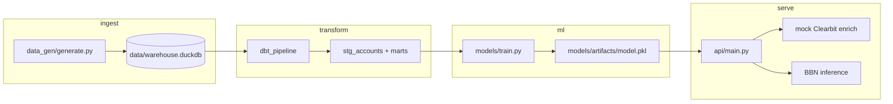

# Latent Sentiment BBN

End-to-end pipeline for inferring latent customer sentiment from firmographics and engagement signals using a Bayesian belief network (pgmpy), a local DuckDB warehouse, dbt transformations, and a FastAPI serving layer.

## Repository layout

```
├── data/                    # Local warehouse storage (.duckdb files)
├── dbt_pipeline/            # Complete dbt project
│   ├── models/              # dbt SQL transformation models
│   ├── dbt_project.yml      # dbt configuration
│   └── profiles.yml         # Connection profile for DuckDB
├── src/                     # Core application source code
│   ├── __init__.py
│   ├── api/                 # FastAPI application layer
│   │   ├── main.py          # API entry point & routes
│   │   └── services.py      # Mock Clearbit & model loading logic
│   ├── data_gen/            # Synthetic data generation scripts
│   └── models/              # pgmpy training and inference logic
│       ├── train.py         # Structure & parameter learning script
│       └── artifacts/       # Saved serialized model (model.pkl)
├── tests/                   # PyTest suite for API and transformations
├── pyproject.toml           # uv dependencies and metadata
└── README.md
```

## Architecture



## Quick start

```bash
# Install runtime + dev dependencies
uv sync --all-groups

# Seed local DuckDB warehouse
uv run python -m data_gen.generate

# Run dbt from the pipeline directory
cd dbt_pipeline && uv run dbt run

# Train BBN and write model.pkl
uv run python -m models.train

# Start API
uv run latent-sentiment-api

# Run tests
uv run pytest
```

## Legacy entry point

The original console script remains available:

```bash
uv run latent-sentiment-bbn
```
